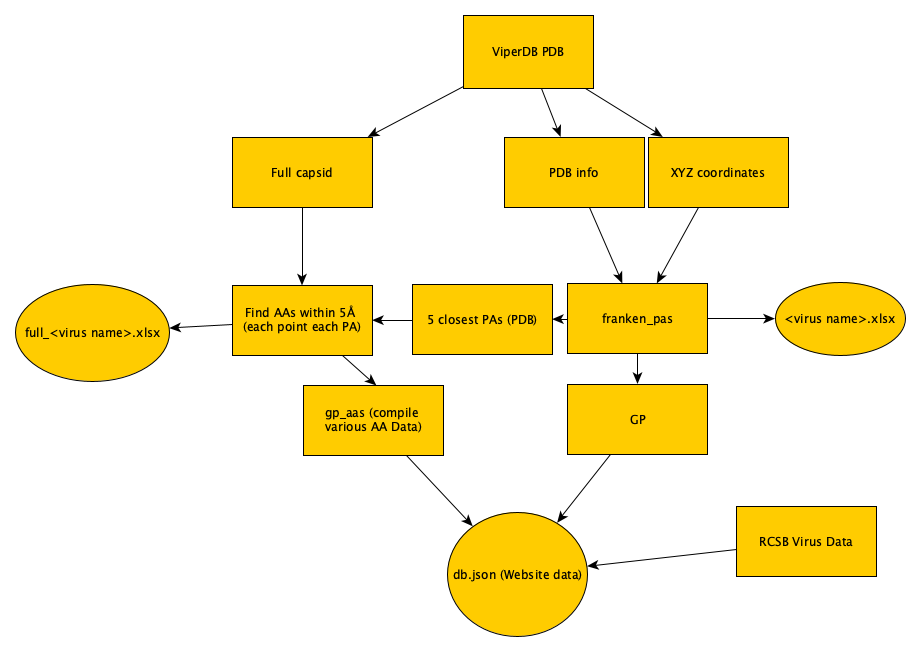

# Web application

url: https://pa-project-66d90.web.app/  
data processing scripts: https://github.com/gabeorosan/vquery/tree/master/scripts

This is a reposity for the website I created to visualize data from spherical viruses as a part of my SIP research under
Dr.Wilson at Kalamazoo College

On the top left you can click the hamburger icon to open up a search for specific virus data

Clicking any of the center icons will let you make a graph of that type (scatter, bar, pie, heatmap), initialized with
random data. To filter out certain viruses, use the filter dropdowns above the graph (if none are checked then nothing
is filtered; if at least one box is checked in a dropdown then all checked boxes are included and others are
excluded). Click the refresh button on the top left to update the graph. For selection of discrete categories (e.g.
you want to show Tnumbers 1 & 3 on a bar graph), change the axis dropdown to the category - tnumber - and select the
tnumbers that you want to be included in the filter dropdown.

# SIP outline

This is the outline for my (Gabe Orosan-Weine) SIP at Kalamazoo College under Dr.Wilson

# Background

The capsid of a virus, meaning the protein shell around the viral genome, largely dictates how the virus binds to and
enters target cells. Understanding the relationship between the capsid of the virus and its other properties is of
medical relevance for pharmaceutical and vaccine design, and could be useful for many other biological inquiries. One of
the main ways capsids are characterized is by their Triangulation number (T-number), describing the number of
proteins that form a virus's Asymmetric Unit (AU), which is then rotated to form the full capsid. While this
classification is useful for some purposes, it is lacking in that it does not take into account the orientation of
proteins or 3-dimensional nature of the capsid structure, and thus does not have the ability to delineate some structural properties 
of interest.
Viral capsids are primarily either helical or spherical, the latter of which being the main focus
of our research. The name spherical is a bit of a misnomer; spherical viruses are classified as such if they exhibit
icosahedral symmetry (meaning they are symmetric along 2, 3, and 5-fold axes). Previous research has shown the ability
of point arrays (formed by rotation and extending the icosahedral shell in predetermined ways) to identify geometric
constraints that must be obeyed by the capsid (Wilson 2020). One of the main findings has been that the protrusions of
viruses are placed on gauge points along the icosahedral great circles of the capsid, and this has lead to the
uncovering of a relationship between gauge points and the genome of viruses (Wilson and Roof 2021). 

# Goals

The identification of spherical viruses, downloading of their coordinates, and calculation of point arrays has largely
been done by hand by members of Dr.Wilson's research group in the past. So the goal of my SIP was to develop
computational tools to automate the process of calculating point arrays of applicable viruses, develop and run other
analysis scripts, and create a web application to investigate and visualize relationships between different properties
of viral capsids.

# Overview

The first thing I worked on was developing a script called find_aas.py to detect which amino acids were nearby (<5Å) the points on a given
point array and write the results to an excel file. I also made a shell script to loop over a folder of point arrays and
later used pyinstaller to create an executable of the python script, as well as an adapted PA-folder script.

Dr.Wilson already had the SC_frankencode.m script (mostly) working, which mainly identifies the gauge points of a viral
capsid given the XYZ coordinates of its AU (asymmetric unit). So the next thing I worked on was creating a pipeline that
pulled all PDB (Protein Data Bank) IDs, downloaded each of their coordinate files, ran
makeicos.pl to create the full capsid of the AU in the coordinate file, ran extract_coords.pl to get the XYZ
coordinates, ran pdb_indo.pl to load the capsid, ran my version of SC_frankencode which writes the output to an excel
file (along with the points of the 5 closest Point Arrays to protrusions), and ran find_aas.py on each point array. This
produced ~1200 excel files which I then converted to CSV files, and looped through to create a JSON file with all the
collected data.

The last stage of my work has been focused on making a website where you can view, filter, and graph the different properties of
viral capsids, including relevant data from ViperDB and RCSB (Research Collaboratory for Structural Bioinformatics) PDB,
fold data from SCOP (Structural Classification of Proteins), and the data generated from SC_frankencode.m and
find_aas.py. The repository for the website can be viewed [here](https://github.com/gabeorosan/vquery). This involved
using APIs to query data for each capsid, along with writing my own scripts to parse, analyze, and compile results. Data
visualization is done with D3.js (Data-Driven Documents)

Along the way, I wrote a couple helper modules (plot_util.py and req_util.py) and many scripts to compile data for
specific families (Parvovididae), protein fold groups, non-t1 viruses from the phrenology paper, data for each capsid in
each family, and more which ended up being superseded by the complete dataset once I was able to get the pipeline
working on one of Dr.Wilson's lab computers so I could automate the execution on all capsids in ViperDB.

# Finding Structurally Relevant Amino Acids

## find_aas.py

The purpose of this script is to take in two input files: one with the x,y,z coordinates of the full capsid of a virus, and the
other with coordinates of the points of a relevant point array (PA), and compile a list of the closes amino acid residue to
each PA point for each protein chain in the capsid. In order to accomplish this, I first parsed the coordinates into a
dictionary mapping each chain to the coordinates of each constituent atom. I also parsed the coordinates of the PA file
into a list of [x,y,z] point coordinates. Next, I looped through each chain and used the function scipy.spatial.distance.cdist (scipy is a python
library for scientific computing) to compute the distances from each member point for the chain to each point in the
point array. I stored the minimum distance, along with the corresponding residue and atom, and looped through the sorted
distances to find one where the distance was less than 5 and the residue was not the same as the closest one, storing
that residue if it existed or N/A otherwise. Finally, I wrote the results to an xlsx file, with a row for each PA point
and 5 columns for each PA chain.

Most viral capsids have multiple PAs of interest, so I also wrote a shell script called run_pas.sh to run find_aas.py with a capsid for
every point array file in a designated folder, and adapted the find_aas.py script so that if the excel file being
written to (named after the capsid) already exists, then the results would be written to a new sheet so that the result
of the script being run on a folder is an excel file with sheets named after each PA and storing their respective
results.

Additionally, since in the script I made use of scipy, pandas, numpy, and openpyxl (all python libraries which must be
installed by the user), I used pyinstaller to convert the script into an executable file find_aas_exec bundled with all
the dependencies mentioned (and adapted the run_pas script accordingly, naming the new one run_pas_exec.sh). However,
because the executable is slightly slower than the python script given the bundled dependencies, I ended up using the
python script in the automated pipeline discussed below.

# Download and analysis pipeline

## dl_ids.py

The first part of the pipeline to analyze all spherical viral capsids on ViperDB was a script that collects all the PDB
IDs through ViperDB's web api and downloads the file with their coordinates and AA residues. To do this, I wrote a small
module called req_util.py, containing variables and functions to form requests by tnumber, genus, or family and used
this to compile a text document with each PDBID. Next, I used a python library called selenium to automate the process
of downloading the coordinate files: opening the URL associated with a given PDBID and clicking on the right download
button. I ended up having to add a delay of 1 second so that the download went through before navigating to the next ID,
but this was not a major concern as the analysis scripts take much longer to run on each capsid. Finally, this script
calls pdb.sh, which unzips the downloaded file, changes the ending to pdb (from vdb) and runs makeicos.pl and
extract_coords.pl to compile the full capsid coordinate file (ViperDB only gives you the coordinates for the AU) for
find_aas.py and the
XYZ file used in SC_frankencode.m.

## ids_franken.py

Next was actually running the analysis scripts - SC_frankencode.m (or, really my version of it callen franken_pas.m
which writes the results to an excel file named after the virus it is called on, and writes the point coordinates of the
5 closest PAs to pdb files) and find_aas.py. Before I could do this, I had to write and
execute a matlab
script which loaded the necessary virus info into Matlab, output from running pdb_info.pl on the capsid coordinate file.
Next, I ran franken_pas.m by using the Matlab CLI, and finished by calling group_pas.sh, which executes find_aas.py on
each point array recorded for the capsid and moves the resulting xlsx files into xlfiles/. This process is repeated for each
line in the input file (which should be the PDBIDs).

# Organizing results and accessory data

## xlfiles to JSON pipeline

I decided to use Firebase , a Google Cloud service, for my database and website hosting because I have some experience
with it and allows you an easy interface to design a web application for many users for free. So once I had excel files containing all the results from franken_pas.m and find_aas.py, I worked on converting them into a
JSON file so that I could upload them to Firebase. First, I decided to convert them to CSV files because then I could
read them more easily in python. Because I did not feel that this process would be particularly important to streamline,
I worked across a few jupyter notebooks to convert the data, adding and correcting bits along the way - the important
additions are detailed below.

## SCOP, RCSB, and data parsing

The main pieces of information that I decided to collect for each capsid consisted of properties such as weight, number of
atoms, etc. from RCSB and fold data from SCOP. For the RCSB information, I used functions from req_util.py in a jupyter
notebook to compile an excel file I named families.xlsx with sheets named after each family with viruses on ViperDB, containing the PDB and corresponding data for each
virus in the family. I then read this data from the excel file and added it to a dictionary loaded from the JSON
database file, writing the result into a new JSON file. For the SCOP data, I mainly worked from the downloadable file
from SCOP's download page containing all of the classifications for each capsid. From Nasir and Caetano-Anollés, 2017
Dr.Wilson and I compiled a list of the translation from the fold names used in SCOP to the names used in Nasir and/or
Krupovica and Koonin, 2017 and I used this to write the desired fold name to the database data for each capsid if it was
listed on SCOP. I also wrote a script to output a text file containing the frequency of each AA in each protein capsid. 
Additionally, in order to make the most relevant data quickly available, I parsed the GP and AA data resulting from
franken_pas.m and find_aas.py respectively to find the closest GP and most common AA within 5 Angstroms of the stored
PAs.
I also used count_aas.py to create a json file (aas.json) with the counts of each AA in the full capsid for each virus -
later incorporated into the db.json database for the website.
Finally, I made a couple other endpoints in Firebase: one containing all the fields (families, genuses, etc) which at least one virus in
the dataset had - this serves as the list of filters which are shown on the website - and another with the list of discrete
(tnumber, GP, etc.) and
continuous metrics (average radius, weight) properties to be used for the options for the axes for different kinds of
graphs. 

# Website 

Once I had the complete database, I worked on making the main features of the website: a search feature that allows you
to query the information stored for any specific PDBID, Scatter Plots, Bar Graphs, Pie Charts, and Heatmaps. Because
of the way I stored all data as singular fields for each virus, and there are only ~1200 spherical capsids on ViperDB, I
decided to load all viruses and all associated data into the web app as soon as it opens so that any filters applied
or axis change would not require a new query.

## Filters

One of the main use cases I had in mind for my web application was to be able to determine the range of a feature (like
primary gauge point) across viruses within a certain sub-category - I refer to discrete properties (i.e. tnumber) as
categories, and the possible values (ex. 1, 3, pT3) as classes. In order to implement this behavior,
I decided to create a series of dropdown menus above every graph element where the name of each dropdown is a category
and the content of each dropdown is a series of checkboxes for each class that at least one virus
has for that property.

## Scatter Plot

The function which creates a scatter plot takes in an ID for the graph element (generated randomly), a list of [x,y] continuous metrics to
plot, and an object containing the selected filters. The object is created by calling loadFilters, a function which
returns true for each checked class in each category. For every key in the filter object (corresponding to categories where at
least one class was checked), every virus which does not have the category registered or whose class for that category
is not in the list of checked classes is filtered out. The graph element is created with the filtered data, titled with
the x and y-axis metrics and the number of data points, and with dropdowns initialized with the given metrics on each
axis. When a user clicks on the scatter plot
button initially, I decided to choose randomly from the list of continuous variables, loaded from the properties endpoint in
Firebase. The graph element is inserted into the page, along with all the filters, and the user has the option to
refresh the graph by clicking the refresh button after changing any of the filters & axes. Additionally, I added a download button which allows the
user to download a txt file containing the x and y coordinates of each point.

## Bar Graph

The main difference between the bar graph and scatter plot is that the x-axis is a list of classes from a category, and
the y-axis is the average of a continuous variable over those classes. The x-axis dropdown thus contains all discrete
variables in the database, and whichever one is selected then looks to the filter dropdown checkboxes to determine which
classes in that category to include. One possible addition could be giving the option to plot the counts, or allowing functions
other than the average of count of a given continuous metric.

## Pie Chart

The function to create a pie chart takes in a single category and plots the count of each class within that family.
Because of space concerns, the slices on the pie chart are not labeled but the downloadable data contains the class
label and value for each slice.

## Heatmap

To create the heatmap, a list of classes has to be supplied for both the x and y axes; this is done the
same way as the bar chart where it is random at first and then the item selected in the axis dropdown turns the filters
for that category into the classes used in the heatmap. Then, the average of the selected continuous variable is
calculated and used to determine the degree of shading for the each box corresponding to the intersection of a class
for each axis.

